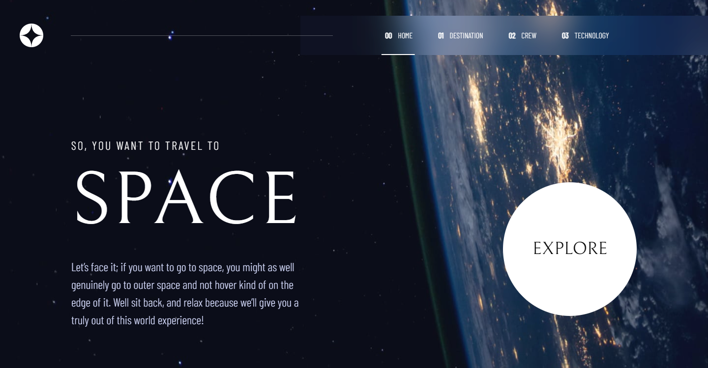
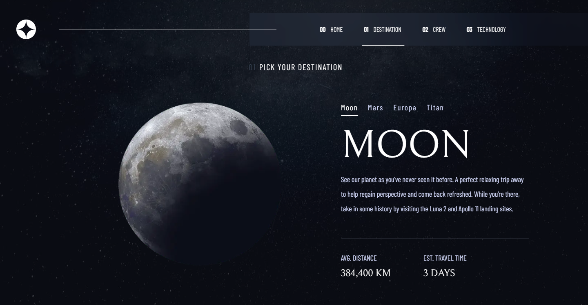
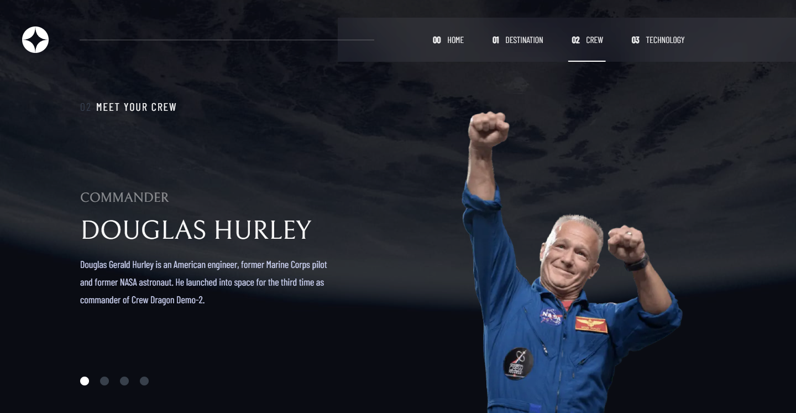
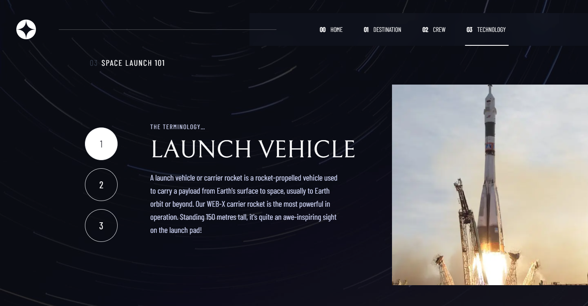

# Frontend Mentor - Space tourism website solution

This is a solution to the [Space tourism website challenge on Frontend Mentor](https://www.frontendmentor.io/challenges/space-tourism-multipage-website-gRWj1URZ3). Frontend Mentor challenges help you improve your coding skills by building realistic projects.

## Table of contents

- [Overview](#overview)
  - [Screenshot](#screenshot)
  - [Live Site](#livesite)
  - [Built with](#built-with)
- [Author](#author)

## Overview

### The challenge

Users should be able to:

- View the optimal layout for each of the website's pages depending on their device's screen size
- See hover states for all interactive elements on the page
- View each page and be able to toggle between the tabs to see new information

### Screenshot

#### Desktop

#### Tablet

#### Mobile

### Live Site

[Click Here](https://vermillion-narwhal-2cc999.netlify.app/)

### Built with

- React
- Next JS
- Framer Motion
- R3F
- Tailwind CSS Framework
- CSS Flexbox and Grid

## Author

- Amir Hossein Azizi
- Frontend Mentor - [@amirhazizi](https://www.frontendmentor.io/profile/amirhazizi)
